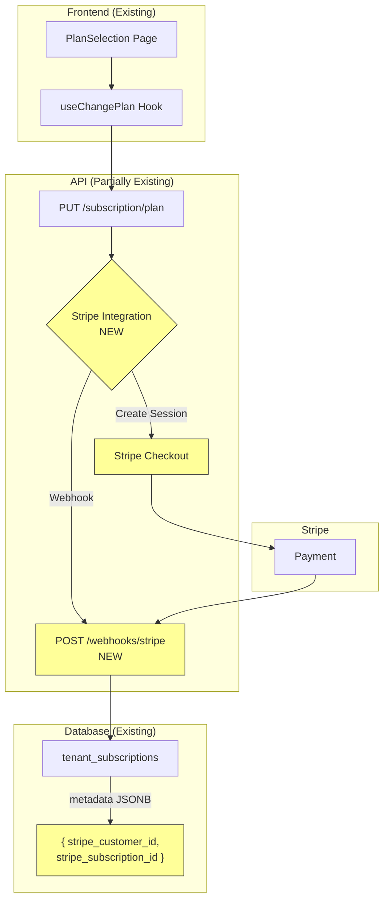
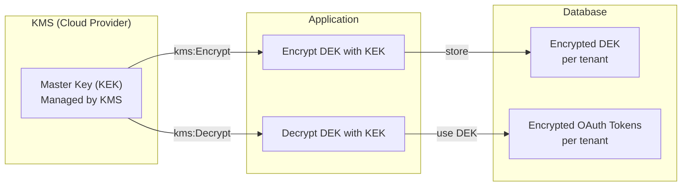
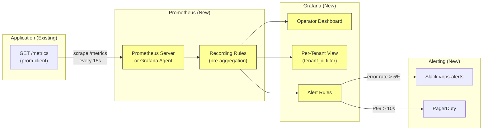
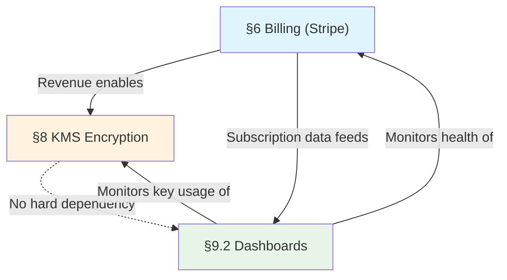
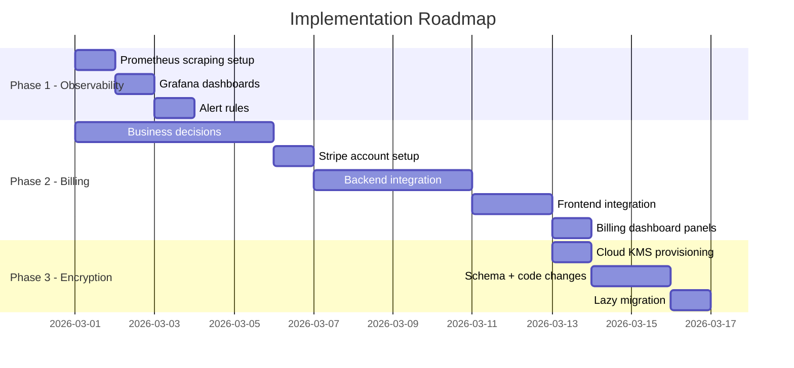

# Business & Infrastructure Decision Guide

**Date**: 2026-02-25
**Context**: The multi-tenant audit identified 3 remaining items that require **business or infrastructure decisions**, not code changes. This document provides comprehensive analysis, options, prerequisites, implementation paths, and cost estimates for each.

---

## Table of Contents

1. [§6 Billing Integration (Stripe)](#1-billing-integration-stripe)
2. [§8 Per-Tenant Encryption (KMS)](#2-per-tenant-encryption-kms)
3. [§9.2 Per-Tenant Dashboards & Alerting](#3-per-tenant-dashboards--alerting)
4. [Cross-Cutting Dependencies](#4-cross-cutting-dependencies)
5. [Recommended Sequencing](#5-recommended-sequencing)

---

## 1. Billing Integration (Stripe)

### Current State

The codebase has a **complete subscription system** ready for billing integration:

| Component          | Status             | Evidence                                                                                                           |
| ------------------ | ------------------ | ------------------------------------------------------------------------------------------------------------------ |
| Plan tiers         | ✅ 4 tiers defined | `018_subscription_plans.sql` — Free ($0), Pro ($49/mo), Team ($149/mo), Enterprise (custom)                        |
| Plan limits        | ✅ Enforced        | `max_repositories`, `max_analyses_monthly`, `max_integrations`, `max_team_members`                                 |
| Feature flags      | ✅ 7 boolean flags | `slack_integration`, `custom_rules`, `team_analytics`, `sso_saml`, `audit_log`, `api_access`, `priority_support`   |
| Subscription table | ✅ Stripe-ready    | `tenant_subscriptions.metadata JSONB` — comment says "Reserved for billing provider references (e.g., Stripe IDs)" |
| Status lifecycle   | ✅ Full            | `active`, `trialing`, `past_due`, `canceled`                                                                       |
| Trial support      | ✅ Built           | `trial_ends_at` column + 24h expiration cron in `index.ts`                                                         |
| Downgrade guards   | ✅ Built           | `handleChangePlan` blocks downgrades exceeding target plan limits (`DOWNGRADE_BLOCKED`)                            |
| Permission gating  | ✅ Built           | `requirePermission("billing")` on `PUT /api/v1/subscription/plan`                                                  |
| Usage tracking     | ✅ Built           | Real-time counts for repos, analyses, integrations, team members                                                   |
| Frontend hooks     | ✅ Built           | `useSubscription()`, `useChangePlan()`, `usePlans()`, `useSubscriptionUsage()`                                     |
| Usage warnings     | ✅ Rendered        | `UsageWarning` 3x in Settings, `TeamUsageGauge` in TeamManagement                                                  |

### What's Missing

Only the **payment provider connection** is absent — no code talks to Stripe (or any payment processor).

### Business Decisions Required

> [!IMPORTANT]
> These decisions must be made before any engineering work begins.

| #   | Decision               | Options                                       | Recommendation                                                                                                          |
| --- | ---------------------- | --------------------------------------------- | ----------------------------------------------------------------------------------------------------------------------- |
| 1   | **Payment provider**   | Stripe / Paddle / LemonSqueezy / Chargebee    | **Stripe** — industry standard for SaaS, best API, widest feature set                                                   |
| 2   | **Billing model**      | Flat-rate / Usage-based / Hybrid              | **Flat-rate** — matches current `price_monthly_cents` schema. Usage-based can be added later via Stripe metered billing |
| 3   | **Billing entity**     | Who invoices? Individual vs company           | Determines Stripe account type (Standard vs Connect)                                                                    |
| 4   | **Tax handling**       | Stripe Tax / manual / third-party (Avalara)   | **Stripe Tax** — automatic for 50+ jurisdictions, $0.50/transaction                                                     |
| 5   | **Enterprise pricing** | Sales-led (manual) / Self-serve custom quotes | **Sales-led** — `price_monthly_cents IS NULL` for enterprise already accommodates this                                  |
| 6   | **Free → Paid flow**   | Card required upfront / Card on upgrade only  | **Card on upgrade** — reduces friction on signup                                                                        |
| 7   | **Trial duration**     | 7 / 14 / 30 days                              | Existing `trial_ends_at` supports any value                                                                             |
| 8   | **Dunning behavior**   | Grace period before downgrade to Free         | Maps to Stripe's `past_due` → eventual `canceled` lifecycle                                                             |

### Implementation Architecture



### Implementation Path (After Decisions Made)

#### Phase 1: Stripe Account & Products (1 day, manual)

1. Create Stripe account (or Stripe Test account)
2. Create 3 Products + Prices matching Pro/Team/Enterprise tiers
3. Configure webhook endpoint URL
4. Store API keys securely

#### Phase 2: Backend Integration (3-4 days)

| File                                                   | Change                                                                                                                                                       |
| ------------------------------------------------------ | ------------------------------------------------------------------------------------------------------------------------------------------------------------ |
| `[NEW] services/api/src/routes/stripeWebhookRoutes.ts` | Webhook handler for `checkout.session.completed`, `invoice.paid`, `invoice.payment_failed`, `customer.subscription.updated`, `customer.subscription.deleted` |
| `[NEW] services/api/src/services/stripeService.ts`     | `createCheckoutSession()`, `createBillingPortalSession()`, `syncSubscriptionFromStripe()`                                                                    |
| `[MODIFY] subscriptionRoutes.ts` → `handleChangePlan`  | Add Stripe Checkout Session creation for paid plans, redirect to Stripe                                                                                      |
| `[MODIFY] tenant_subscriptions` → `metadata`           | Store `{ stripe_customer_id, stripe_subscription_id, stripe_price_id }`                                                                                      |
| `[NEW] POST /api/v1/billing/portal`                    | Stripe Customer Portal for self-serve management                                                                                                             |

#### Phase 3: Frontend Integration (1-2 days)

| File                                            | Change                                                       |
| ----------------------------------------------- | ------------------------------------------------------------ |
| `[MODIFY] PlanSelection.tsx`                    | Add Stripe Checkout redirect for paid plans                  |
| `[NEW] BillingSettings section` in Settings.tsx | Show current plan, next invoice, payment method, portal link |
| `[MODIFY] useChangePlan` hook                   | Handle Stripe Checkout redirect flow                         |

### Estimated Costs

| Item                   | Cost                    |
| ---------------------- | ----------------------- |
| Stripe transaction fee | 2.9% + $0.30 per charge |
| Stripe Tax (optional)  | $0.50 per transaction   |
| Engineering effort     | ~1 week                 |
| Ongoing maintenance    | ~2 hrs/month            |

### Prerequisites

- [ ] Stripe account created
- [ ] Business entity determined
- [ ] Pricing confirmed (or test pricing for staging)
- [ ] Webhook endpoint URL known (requires deployed API URL)

---

## 2. Per-Tenant Encryption (KMS)

### Current State

| Component            | Status      | Evidence                                                                        |
| -------------------- | ----------- | ------------------------------------------------------------------------------- |
| App-level encryption | ✅ Working  | `encryption.ts` — AES-256-GCM, single key from `ENCRYPTION_KEY` env var         |
| Token encryption     | ✅ Used     | `encryptValue()` / `decryptValue()` for OAuth tokens in `integrationService.ts` |
| Key validation       | ✅ Enforced | Production invariant — crashes if `ENCRYPTION_KEY` not set in prod              |
| Graceful migration   | ✅ Built    | `decryptValue()` handles plaintext values (pre-encryption migration)            |
| PII separation       | ✅ Done     | `026_pii_separation.sql` — `user_pii` table isolates personal data              |

### What's Missing

A single `ENCRYPTION_KEY` encrypts **all tenants' data**. If the key is compromised, all tenants' OAuth tokens are exposed. Per-tenant KMS would isolate blast radius.

### Infrastructure Decision Required

> [!IMPORTANT]
> This is an infrastructure provisioning decision, not a code change.

| #   | Decision               | Options                                                     | Recommendation                                                                                                          |
| --- | ---------------------- | ----------------------------------------------------------- | ----------------------------------------------------------------------------------------------------------------------- |
| 1   | **KMS provider**       | AWS KMS / GCP Cloud KMS / Azure Key Vault / HashiCorp Vault | Depends on cloud provider — **AWS KMS** if on AWS, **GCP Cloud KMS** if on GCP                                          |
| 2   | **Key hierarchy**      | Per-tenant DEK + master KEK / Per-tenant KMS key            | **Envelope encryption** — one KMS-managed KEK wraps per-tenant DEKs. Per-tenant KMS keys at $1/month each get expensive |
| 3   | **Migration strategy** | Big-bang re-encrypt / Lazy re-encrypt on read               | **Lazy re-encrypt** — matches existing `decryptValue()` graceful fallback                                               |
| 4   | **Key rotation**       | Manual / Automatic (annual)                                 | **Auto-rotate annually** — KMS supports automatic rotation                                                              |
| 5   | **When to implement**  | Before / after billing                                      | **After billing** — current single-key AES-256-GCM is strong; KMS is defense-in-depth                                   |

### Architecture: Envelope Encryption



### Implementation Path (After Decisions Made)

#### Phase 1: Infrastructure Provisioning (0.5 day)

1. Create KMS master key (KEK) in chosen cloud provider
2. Create IAM role/service account with `kms:Encrypt`, `kms:Decrypt` permissions
3. Configure key rotation policy (recommend: annual auto-rotate)

#### Phase 2: Database Schema (0.5 day)

```sql
-- New table for per-tenant data encryption keys
CREATE TABLE IF NOT EXISTS tenant_encryption_keys (
    tenant_id VARCHAR(255) PRIMARY KEY REFERENCES tenants(id),
    encrypted_dek BYTEA NOT NULL,          -- DEK encrypted by KMS KEK
    kms_key_arn VARCHAR(512) NOT NULL,      -- Which KEK was used
    key_version INTEGER NOT NULL DEFAULT 1, -- For rotation tracking
    created_at TIMESTAMPTZ NOT NULL DEFAULT CURRENT_TIMESTAMP,
    rotated_at TIMESTAMPTZ
);
```

#### Phase 3: Code Changes (2 days)

| File                                 | Change                                                                                                    |
| ------------------------------------ | --------------------------------------------------------------------------------------------------------- |
| `[NEW] security/kmsClient.ts`        | AWS KMS / GCP Cloud KMS SDK wrapper — `wrapDEK()`, `unwrapDEK()`                                          |
| `[NEW] security/tenantEncryption.ts` | `getOrCreateTenantDEK()`, `encryptForTenant()`, `decryptForTenant()` with in-memory DEK cache (TTL 5 min) |
| `[MODIFY] encryption.ts`             | Add `encryptWithDEK()` / `decryptWithDEK()` alongside existing functions                                  |
| `[MODIFY] integrationService.ts`     | Swap `encryptValue()` → `encryptForTenant(tenantId, value)`                                               |
| `[MODIFY] serviceLifecycle.ts`       | Generate DEK on tenant creation, delete on hard delete                                                    |

#### Phase 4: Migration (0.5 day)

- Lazy migration: `decryptForTenant()` tries tenant DEK first, falls back to global key, then re-encrypts with tenant DEK
- Matches existing `decryptValue()` plaintext fallback pattern

### Estimated Costs

| Item                     | Cost                                                             |
| ------------------------ | ---------------------------------------------------------------- |
| AWS KMS master key       | $1/month (1 key, regardless of tenant count)                     |
| AWS KMS API calls        | $0.03 per 10,000 requests (DEK cache reduces this significantly) |
| GCP Cloud KMS equivalent | $0.06/key/month + $0.03 per 10,000 operations                    |
| Engineering effort       | ~3 days                                                          |
| Ongoing maintenance      | ~1 hr/month (monitor key usage, rotation)                        |

### Prerequisites

- [ ] Cloud provider confirmed (AWS / GCP / Azure)
- [ ] KMS permissions provisioned for application's IAM role
- [ ] DEK cache strategy validated (in-memory with TTL vs Redis)
- [ ] Rollback plan documented (revert to global key)

---

## 3. Per-Tenant Dashboards & Alerting

### Current State

| Component                     | Status     | Evidence                                                                               |
| ----------------------------- | ---------- | -------------------------------------------------------------------------------------- |
| Per-tenant Prometheus metrics | ✅ Done    | `metrics.ts` — 8 metrics, all with `tenant_id` label                                   |
| Metrics middleware            | ✅ Done    | `metricsMiddleware.ts` — auto-records per request, route normalization for cardinality |
| Metrics endpoint              | ✅ Done    | `GET /metrics` serves Prometheus text format                                           |
| Usage threshold alerting      | ✅ Done    | `usageAlerts.ts` — `checkUsageThresholds()` with dedup                                 |
| Cardinality management        | ✅ Planned | Comment warns about 1M series at 1K tenants, recommends recording rules                |

### What's Missing

The **metrics are emitted** but no **visualization layer** (Grafana, Datadog) or **alerting pipeline** (PagerDuty, OpsGenie) is configured to consume them.

### Infrastructure Decision Required

> [!IMPORTANT]
> This is a DevOps/infrastructure configuration task — provisioning monitoring tools and alert routing.

| #   | Decision                       | Options                                                                                 | Recommendation                                                                                             |
| --- | ------------------------------ | --------------------------------------------------------------------------------------- | ---------------------------------------------------------------------------------------------------------- |
| 1   | **Metrics store**              | Prometheus (self-hosted) / Grafana Cloud / Datadog / AWS CloudWatch                     | **Grafana Cloud** — free tier for up to 10K metrics, managed, no infra to maintain                         |
| 2   | **Dashboard tool**             | Grafana / Datadog Dashboards / Custom admin UI                                          | **Grafana** — pairs naturally with Prometheus metrics already being emitted                                |
| 3   | **Alert routing**              | Grafana Alerting / PagerDuty / OpsGenie                                                 | **Grafana Alerting** → PagerDuty/Slack — keeps stack simple                                                |
| 4   | **Tenant isolation**           | Shared dashboard with tenant filter / Per-tenant dashboard via Grafana provisioning API | **Shared + filter** initially — per-tenant dashboards at scale (100+ tenants) via Grafana provisioning API |
| 5   | **Cardinality management**     | Recording rules / Label drop / Metric relabeling                                        | **Prometheus recording rules** — pre-aggregate `sum by (tenant_id)` for dashboards                         |
| 6   | **Customer-facing dashboards** | Grafana embedded panels / Custom UI / None                                              | **Phase 2** — build custom admin UI reading from same Prometheus data                                      |

### Architecture



### Implementation Path (After Decisions Made)

#### Phase 1: Prometheus Scraping (0.5 day)

1. Deploy Prometheus server or Grafana Agent to scrape `GET /metrics` endpoint
2. Configure scrape interval (15s recommended)
3. Add recording rules for pre-aggregation:

```yaml
groups:
  - name: kenchi_tenant_aggregations
    interval: 1m
    rules:
      - record: kenchi:api_request_rate:by_tenant
        expr: sum(rate(kenchi_api_requests_total[5m])) by (tenant_id)
      - record: kenchi:api_error_rate:by_tenant
        expr: |
          sum(rate(kenchi_api_requests_total{status_code=~"5.."}[5m])) by (tenant_id)
          / sum(rate(kenchi_api_requests_total[5m])) by (tenant_id)
      - record: kenchi:analysis_duration_p99:by_tenant
        expr: histogram_quantile(0.99, sum(rate(kenchi_analysis_duration_seconds_bucket[5m])) by (le, tenant_id))
```

#### Phase 2: Grafana Dashboards (1 day)

1. Connect Grafana to Prometheus data source
2. Create **Operator Overview** dashboard:
   - Total requests/sec across all tenants
   - Top 10 tenants by request volume
   - Error rate heatmap by tenant
   - Analysis queue depth and duration
   - Active DB connections gauge
3. Create **Per-Tenant Detail** dashboard:
   - Filterable by `tenant_id` variable
   - Request rate, error rate, latency percentiles
   - Analysis count & duration
   - External API call success rate
   - Active analysis jobs

#### Phase 3: Alert Rules (0.5 day)

| Alert                    | Condition                                              | Channel    | Severity |
| ------------------------ | ------------------------------------------------------ | ---------- | -------- |
| High error rate          | `kenchi:api_error_rate:by_tenant > 0.05` for 5m        | Slack #ops | Warning  |
| Extreme error rate       | `kenchi:api_error_rate:by_tenant > 0.20` for 2m        | PagerDuty  | Critical |
| Slow analyses            | `kenchi:analysis_duration_p99:by_tenant > 120` for 10m | Slack #ops | Warning  |
| DB connection exhaustion | `kenchi_active_db_connections > 20` for 5m             | PagerDuty  | Critical |
| Tenant usage spike       | Request rate 10x above 24h average                     | Slack #ops | Info     |

### Estimated Costs

| Item                             | Cost                                            |
| -------------------------------- | ----------------------------------------------- |
| Grafana Cloud (free tier)        | $0/month for up to 10K active series, 50GB logs |
| Grafana Cloud (Pro)              | $29/month per active user + $8/1K series        |
| Self-hosted Prometheus + Grafana | $0 (software) + server cost                     |
| Datadog alternative              | ~$15/host/month + $0.10 per custom metric       |
| Engineering effort               | ~2 days                                         |
| Ongoing maintenance              | ~2 hrs/month (alert tuning, dashboard updates)  |

### Prerequisites

- [ ] Monitoring provider chosen (Grafana Cloud vs self-hosted)
- [ ] Application `/metrics` endpoint accessible from scraper
- [ ] Alert routing channels configured (Slack webhook, PagerDuty API key)
- [ ] Retention policy decided (15 days free / 13 months pro)

---

## 4. Cross-Cutting Dependencies



| Dependency           | Nature         | Notes                                                                                      |
| -------------------- | -------------- | ------------------------------------------------------------------------------------------ |
| Billing → KMS        | **Soft**       | Revenue from billing justifies KMS costs. Current encryption is functional without KMS     |
| Billing → Dashboards | **Data**       | Dashboards should show billing metrics (MRR, churn, plan distribution) once Stripe is live |
| KMS → Dashboards     | **None**       | Independent — KMS key usage can be monitored via cloud provider's native dashboards        |
| Dashboards → Both    | **Monitoring** | Dashboards monitor health of billing webhooks and KMS API latency                          |

---

## 5. Recommended Sequencing



### Rationale

| Order   | Item            | Why This Order                                                                                                                                                 |
| ------- | --------------- | -------------------------------------------------------------------------------------------------------------------------------------------------------------- |
| **1st** | §9.2 Dashboards | Fastest to deliver (2 days). Provides visibility into system health BEFORE making billing changes. Zero business decisions blocking it beyond "which Grafana?" |
| **2nd** | §6 Billing      | Most business value. Subscription system is ~90% built — only Stripe glue code missing. Dashboard already live to monitor webhook health                       |
| **3rd** | §8 KMS          | Defense-in-depth upgrade. Current AES-256-GCM is strong. KMS adds blast-radius isolation but isn't urgent. Revenue from billing justifies the monthly KMS cost |

### Summary of Required Decisions

| #   | Decision                                           | Owner          | Blocking |
| --- | -------------------------------------------------- | -------------- | -------- |
| 1   | Monitoring provider (Grafana Cloud vs self-hosted) | DevOps         | §9.2     |
| 2   | Payment provider (Stripe recommended)              | Business       | §6       |
| 3   | Billing entity (who invoices)                      | Business/Legal | §6       |
| 4   | Pricing confirmation ($49/$149/custom)             | Business       | §6       |
| 5   | Tax handling strategy                              | Business/Legal | §6       |
| 6   | Cloud provider for KMS (AWS/GCP/Azure)             | DevOps         | §8       |
| 7   | Customer-facing dashboards (yes/no/later)          | Product        | §9.2     |

> [!TIP]
> **Quick win**: Start with §9.2 (dashboards) — it requires only one decision ("which Grafana?"), takes 2 days, and immediately improves operational visibility. The other two items have longer decision chains.
